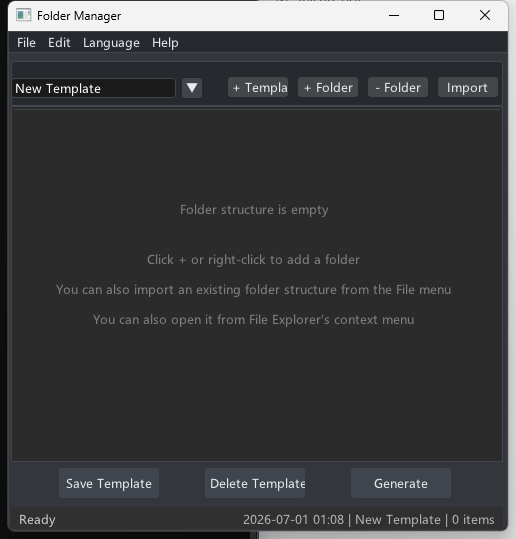
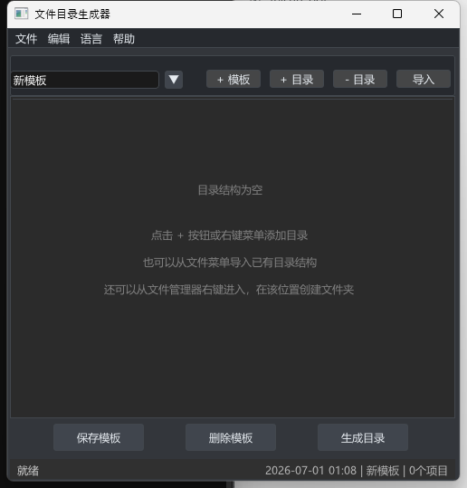

# Folder Manager

[简体中文](README.zh-CN.md) | English

Folder Manager is a Windows folder structure template generator for quickly creating repeated project folders.

It started as a personal utility. When a project, client folder, contract archive, or other workflow needs the same folder structure repeatedly, you can maintain a template once and generate the folders when needed.

## Screenshots





## Features

- Create and edit folder structure templates
- Save, load, and delete templates
- Import folder structures from existing directories
- Generate real folders from a template
- Optionally create a top-level folder during generation
- Add prefixes to generated folder names:
  - Date prefix
  - Path prefix
  - Custom prefix
- Chinese and English interface
- Open the tool from the Windows File Explorer context menu

## Use Cases

- Repeatedly creating project folders
- Standardizing archive structures
- Creating fixed folder hierarchies for clients, cases, contracts, design files, video assets, and similar work
- Turning an existing directory structure into a reusable template

## Platform

- Windows
- C++17
- MinGW-w64
- ImGui + GLFW

## Build

Install MinGW-w64 first, and make sure `g++`, `windres`, and `mingw32-make` are available in `PATH`.

```powershell
mingw32-make
```

After the build finishes, the executable will be generated at:

```text
build/bin/FolderManagerImGui.exe
```

You can also build and run it directly:

```powershell
mingw32-make run
```

Clean build outputs:

```powershell
mingw32-make clean
```

## Releases

The source repository is mainly for developers. Regular users who do not want to compile the project can download an installer such as `FolderManagerSetup.exe` from GitHub Releases when one is available.

This is a personal tool and may not be released or updated frequently.

## Usage

1. Start the application.
2. Click `+ Template` to create a new template.
3. Click `+ Folder` to add folder nodes.
4. Rename folders by double-clicking or using the right-click menu.
5. Save the template.
6. Click the generate button, choose a target location, and generate the folder structure.

When there are no saved templates, the app shows a neutral example template so new users can understand the workflow. The example is not written to template storage unless you save it.

Templates are stored under the current user's AppData directory:

```text
%APPDATA%\FolderManager\Templates
```

Language preference is stored in:

```text
%APPDATA%\FolderManager\settings.ini
```

The app uses the system language on first launch. You can switch languages from `Language` in the menu bar.

## Context Menu

The repository includes files related to registering the app in the Windows File Explorer context menu.

If you use the installer, you can choose whether to add the context menu entry during installation. Without the context menu entry, you can still run the app directly and choose a target directory manually.

## Project Status

This is a personal utility maintained according to my own needs. Long-term support is not guaranteed. Issues are welcome, but I may not handle every issue or feature request in time.

Forks, modifications, and personal use are welcome. If you only need a lightweight folder template generator, feel free to adapt it.

## Known Limitations

- The project mainly targets Windows and has not been adapted for cross-platform use.
- Template import/export support is still basic.
- The UI and interactions are practical rather than polished like a commercial product.
- Very large directory structures are not the primary use case.

## License

This project is licensed under the GNU General Public License v3.0. See [LICENSE](LICENSE) for details.
